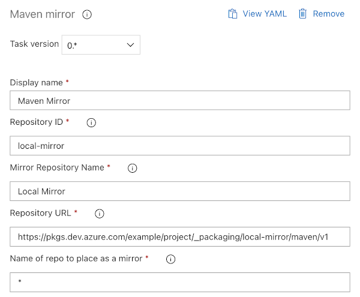

# Azure DevOps pipeline extension

## Configure Maven Mirror

Configure Maven Mirror in settings.xml by pipeline step

## Examples

Azure pilepines (yaml):
```yaml
steps:
- task: kharkevich.azure-devops-mvn-mirror.mvn-mirror.mvn-mirror@0
  displayName: 'Maven Mirror'
  inputs:
    inputId: <Azure Artifacts Repository ID>
    inputName: <Mirror Repository Name>
    inputUrl: 'https://pkgs.dev.azure.com/<ORG>/<PROJECT>/<FEED>/maven/v1'
    inputMirrorOf: <mirrored (source) repo name> # e.g. central, or *
```

Via web interface:

  

See http://maven.apache.org/guides/mini/guide-mirror-settings.html for more details.
